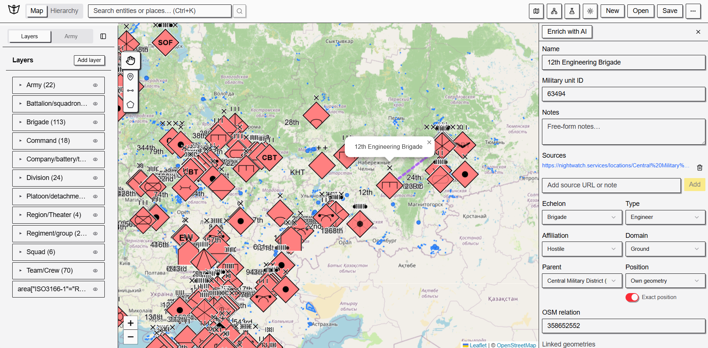

# Gabriel - OSINT Mapping Workstation



Gabriel is a local-first web app to build, inspect, and maintain geospatial OSINT projects with an ORBAT-oriented workflow.

Current investigation context: mapping the industrial, logistic, and financial infrastructure that sustains Russia's war effort.

## Project Scope

Turn fragmented evidence into one auditable project file:

- entities with hierarchy and metadata,
- map geometries (points, lines, polygons),
- layers (custom, echelon, OSM overlay),
- optional AI enrichment suggestions before human validation.

Core principle: **GeoPackage is the source of truth**.

## Run Locally

```bash
npm install
npm run dev
```

Open the URL shown by Vite (usually `http://localhost:5173`).

Public access: [https://gabriel0x0.netlify.app/](https://gabriel0x0.netlify.app/).

## Current Capabilities

- Create and edit ORBAT-oriented map projects.
- Draw and link geometries to entities.
- Use MIL-STD-2525 symbols for military visualization.
- Link entities to OSM relations and open-source context.
- Save/load projects as `.gpkg` (portable GeoPackage files).

## Current Project Snapshot (`public/project.gpkg`)

- `1010` units/entities
- `15` layers
- `286` geometries
- `148` units linked to an OSM relation
- `999` units attached to a parent (hierarchical ORBAT structure)
- `5` research source records

## AI Enrichment (Optional)

1. Open `AI keys` in the top bar.
2. Add:
   - OpenAI API key
   - Tavily API key

Accepted proposals affect the current session state, and become authoritative only through the normal save flow.

## Contributing / Verification

- Keep changes simple and focused.
- Run `npm run verify` before opening a PR.
- Update docs when behavior or architecture changes.

## License

Code in this repository is licensed under the [MIT License](LICENSE).
Dataset artifacts can be released separately under `CC-BY 4.0` when published.

## Technical Documentation

For architecture and implementation details:

- `docs/ARCHITECTURE.md`
- `docs/CONSTRAINTS.md`
- `docs/timelines/ROADMAP.md`
